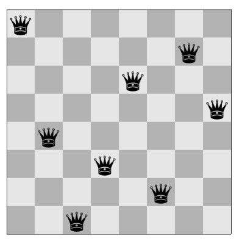
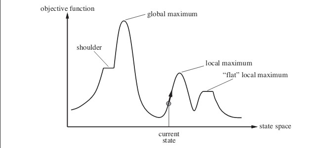

# N-Queens Problem: 
The N Queen is the problem of placing N chess queens on an N×N chessboard so that no two queens attack each other. The chess queens can attack in any direction as horizontal, vertical, horizontal and diagonal way. Below is the pictorial representation of placement of 8 queens on chessboard.

## Hill Climbing:
Hill climbing is a mathematical optimization technique which belongs to the family of local search. It is an iterative algorithm that starts with an arbitrary solution to a problem, then attempts to find a better solution by making an incremental change to the solution. If the change produces a better solution, another incremental change is made to the new solution, and so on until no further improvements can be found.

## State space diagram
State space diagram is a graphical representation of the set of states our search algorithm can reach vs the value of our objective function(the function which we wish to maximize).
X-axis : denotes the state space i.e states or configuration our algorithm may reach.
Y-axis : denotes the values of objective function corresponding to to a particular state.
The best solution will be that state space where objective function has maximum value(global maximum).

Different regions in the State Space Diagram

**Local maximum** : It is a state which is better than its neighboring state however there exists a state which is better than it(global maximum). This state is better because here value of objective function is higher than its neighbors.

**Global maximum** : It is the best possible state in the state space diagram. This because at this state, objective function has highest value.

**Plateau/flat local maximum** : It is a flat region of state space where neighboring states have the same value.

**Ridge** : It is region which is higher than its neighbors but itself has a slope. It is a special kind of local maximum.

**Current state** : The region of state space diagram where we are currently present during the search.

**Shoulder** : It is a plateau that has an uphill edge.

**Steepest-Ascent Hill-Climbing**:  It is a variant of Hill Climbing algorithm. In this algorithm, we consider all possible states from the current state and then pick the best one as successor.

**Allowing sideways moves**:  When stuck on a ridge or plateau (i.e., all successors have the same value), allow it to move anyway hoping it is a shoulder and after some time, there will be a way up.

**Random-restart hill-climbing**: If the first hill-climbing attempt doesn’t work, try again and again and again. That is, generate random initial states and perform hill-climbing again and again.This is random-restart. The number of attempts needs to be limited, this number depends on the problem.

## Problem Implementation Details:

The objective of this program is to implement N Queens problem is by using hill climbing search and its variants. The program will take the number of queens as a variable n and allows the user to input the value of n. We are implementing the below mentioned points in this program:
-	Steepest ascent hill climbing – For this variant the queens are set on board at random positions.
Then we are calculating the attacking pairs which is our heuristic value, we choose the random child from the set of lowest cost heuristics. Then again calculate the heuristic until goal is reached or a failed state is reported.

-	Hill climbing with sideways move – We proceed similarly with sideway moves also but if a local minimum is attained, we again choose one of the lowest cost child and find a shoulder from where global minimum can be attained

-	Random restart hill climbing with and without sideways move- We are starting search from a randomly chosen start node, going all the way uphill. When stuck at local minima, we choose again a random start point to search.
